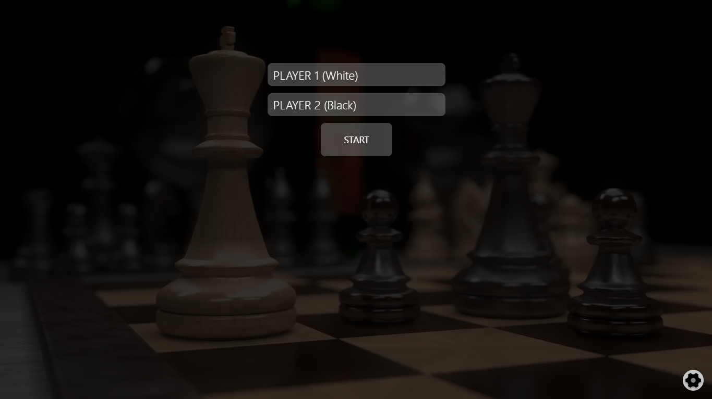
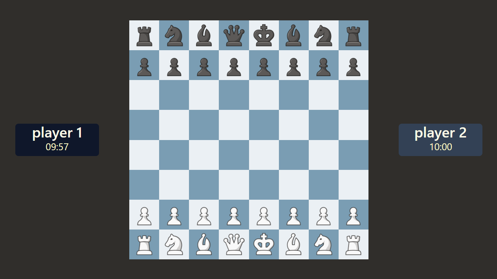

# Chess Game 

A modern, interactive chess application built using **React** and **Tailwind CSS**, featuring a clean UI and turn-based gameplay. The project focuses on implementing core chess mechanics.

## Live Demo
🔗 [Live Demo](https://chess-app-pearl-seven.vercel.app/)

# Screenshots
## Homepage

## Gamescreen


## Features
- Classic 8×8 chess board
- Turn-based gameplay (White vs Black)
- Legal move highlighting
- Piece capture logic
- Move validation
- Piece Promotion
- multiple Boards,Time Control and other Settings

## Tech Stack

### Frontend
- React
- Tailwind CSS
- JavaScript (ES6+)
- Vite

### Libraries & Tools
- React Hooks
- Lucide
- chess.js
- react-chessboard

## Purpose of This Project
This project was built to:
- Practice complex state management in React
- Implement rule-based game logic
- Build reusable components
- Design responsive layouts with Tailwind CSS
- Handle real-time user interactions

## Installation & Setup
```bash
git clone https://github.com/Adityarajbind/chess-app.git
cd chess-app
npm install
npm run dev
```
